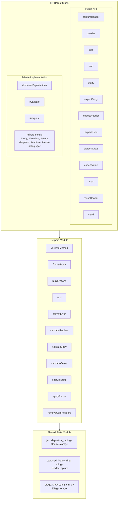
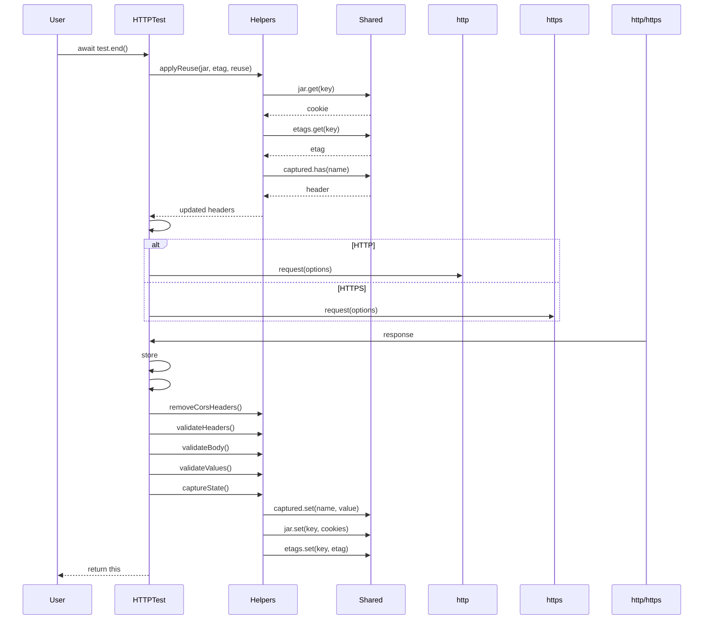

# Technical Architecture

Deep dive into tiny-httptest's internal architecture and implementation.

## Table of Contents

- [Overview](#overview)
- [Component Architecture](#component-architecture)
- [Request Flow](#request-flow)
- [State Management](#state-management)
- [Validation Engine](#validation-engine)
- [Design Patterns](#design-patterns)
- [Data Structures](#data-structures)

---

## Overview

tiny-httptest is a lightweight HTTP test framework built on Node.js's native `http` and `https` modules. It provides a fluent API for chaining HTTP request configurations and validating responses.

### Core Principles

1. **Immutable Configuration**: Request options are built once in the constructor
2. **Mutable State**: Response data and expectations are processed asynchronously
3. **Shared State**: Cookie jar, captured headers, and ETags persist across test instances
4. **Fluent Interface**: Method chaining for readable test code

---

## Component Architecture



---

## Request Flow

### 1. Construction Phase

```javascript
const test = httptest({url, method, body, headers, timeout});
```

**Steps:**
1. Parse URL using `URL` constructor
2. Validate HTTP method
3. Build request options with defaults
4. Initialize private state containers

**Time Complexity:** O(1)

### 2. Configuration Phase

```javascript
test
  .cookies()
  .etags()
  .expectStatus(200)
  .expectHeader("content-type", "application/json");
```

**Steps:**
1. Configure state capture flags (`#jar`, `#etag`)
2. Populate `#expects` Map with validation rules
3. Populate `#capture` Set with headers to capture
4. Populate `#reuse` Set with headers to reuse

**Time Complexity:** O(1) per method call

### 3. Execution Phase

```javascript
await test.end();
```

**Steps:**



**Time Complexity:** O(n) where n = number of expectations

---

## State Management

### Instance State (Private Fields)

| Field | Type | Purpose | Lifetime |
|-------|------|---------|----------|
| `#body` | `string` | Accumulates response body | Instance |
| `#capture` | `Set<string>` | Headers to capture | Instance |
| `#etag` | `boolean` | ETag handling enabled | Instance |
| `#expects` | `Map` | Validation expectations | Instance |
| `#headers` | `Object` | Response headers | Instance |
| `#jar` | `boolean` | Cookie jar enabled | Instance |
| `#reuse` | `Set<string>` | Headers to reuse | Instance |
| `#status` | `number` | Response status code | Instance |

### Shared State (Global Maps)

```javascript
// File: src/shared.js
export const jar = new Map();      // Cookie storage
export const captured = new Map(); // Header capture
export const etags = new Map();    // ETag storage
```

**Key Format:**
- Cookies: `${hostname}${DELIMITER}${port}`
- ETags: `${hostname}${DELIMITER}${port}${path}`

**Persistence:** Shared state persists across all HTTPTest instances, enabling stateful test chains.

---

## Validation Engine

### Validation Types

```javascript
// 1. Function validation
if (expected instanceof Function) {
    valid = expected(actual) === true;
}

// 2. RegExp validation
if (expected instanceof RegExp) {
    valid = expected.test(actual);
}

// 3. Object comparison
if (typeof expected === "object" && typeof actual === "object") {
    valid = JSON.stringify(expected, null, 0) === JSON.stringify(actual, null, 0);
}

// 4. Numeric comparison
if (typeof expected === "number" && typeof actual === "number") {
    valid = Number(expected) === Number(actual);
}

// 5. Strict equality
valid = expected === actual;
```

### Validation Pipeline

```mermaid
flowchart TD
    A["#processExpectations()"] --> B[Check status >= 400]
    B -->|Yes| C[removeCorsHeaders]
    B -->|No| D
    C --> D["#validate(STATUS)"]
    D --> E[validateHeaders]
    E --> F["for each header: validate"]
    F --> G[validateBody]
    G --> H[Check content-type]
    H -->|Yes| I[parse JSON body]
    H -->|No| J
    I --> J["#validate(BODY)"]
    J --> K[validateValues]
    K --> L["for each value: validate"]
    
    M["#validate()"] --> N[Check expected exists]
    N -->|No| O[return]
    N -->|Yes| P[Run test()]
    P -->|Valid| O
    P -->|Invalid| Q[throw Error]
    
    R["test()"] --> S[Check Function]
    S -->|Yes| T[Call expected(actual)]
    S -->|No| U[Check RegExp]
    U -->|Yes| V[Run expected.test(actual)]
    U -->|No| W[Check Object]
    W -->|Yes| X[Compare JSON strings]
    W -->|No| Y[Check Number]
    Y -->|Yes| Z[Compare numbers]
    Y -->|No| AA[Strict equality]
    
    style C fill:#f9f,stroke:#333
    style Q fill:#f96,stroke:#333
```

### Error Handling

```javascript
if (!test(expected, actual)) {
    throw new Error(formatError(type, expected, actual));
}
```

**Error Format:**
```
Expected ${type} to be ${expected}, got ${actual}
```

**Examples:**
- `Expected status to be 200, got 404`
- `Expected header "content-type" to be /application\/json/, got "text/html"`

---

## Design Patterns

### 1. Fluent Interface

All configuration methods return `this` for method chaining:

```javascript
httptest({url})
  .cookies()
  .etags()
  .expectStatus(200)
  .expectHeader("content-type", "application/json")
  .end();
```

### 2. Builder Pattern

`buildOptions()` constructs request configuration:

```javascript
function buildOptions(parsed, method, headers, body, timeout) {
    const options = {
        hostname: parsed.hostname,
        method,
        path: `${parsed.pathname}${parsed.search}`,
        port: parsed.port,
        protocol: parsed.protocol,
        headers: {...headers, [USER_AGENT]: USER_AGENT_VALUE},
        timeout
    };
    // ... add auth, body, content-length
    return options;
}
```

### 3. Strategy Pattern

Validation uses different strategies based on expected type:

```javascript
function test(expected, actual) {
    if (expected instanceof Function) { /* function strategy */ }
    if (expected instanceof RegExp) { /* regex strategy */ }
    if (typeof expected === "object") { /* object strategy */ }
    if (typeof expected === "number") { /* numeric strategy */ }
    // default: strict equality
}
```

### 4. Facade Pattern

`httptest()` factory function provides simple interface:

```javascript
export function httptest({url = LOCALHOST, method = GET, ...} = {}) {
    return new HTTPTest(url, validateMethod(method), headers, body, timeout);
}
```

### 5. Singleton Pattern (Shared State)

Global Maps act as singletons for cross-instance state:

```javascript
// src/shared.js
export const jar = new Map();      // Single cookie jar
export const captured = new Map(); // Single capture store
export const etags = new Map();    // Single ETag store
```

---

## Data Structures

### Map-Based Expectations

```javascript
this.#expects = new Map();
this.#expects.set(STATUS, 0);        // Status expectation
this.#expects.set(BODY, EMPTY);      // Body expectation
this.#expects.set(HEADERS, new Map()); // Header expectations
this.#expects.set(VALUES, new Map());  // JSON value expectations
```

**Benefits:**
- O(1) lookup for validation
- Dynamic expectation addition
- Type-safe access patterns

### Set-Based Capture/Reuse

```javascript
this.#capture = new Set(); // Headers to capture
this.#reuse = new Set();   // Headers to reuse
```

**Benefits:**
- O(1) membership testing
- Automatic deduplication
- Iteration without order dependency

### Shared State Maps

```javascript
// Cookie jar: key = "hostname:port", value = "cookie-string"
jar.set("localhost:8000", "session=abc123");

// ETag store: key = "hostname:port:path", value = "etag-value"
etags.set("localhost:8000:/api/users", '"abc123"');

// Header capture: key = "header-name", value = "header-value"
captured.set("x-csrf-token", "token123");
```

---

## Performance Considerations

### Time Complexity

| Operation | Complexity | Notes |
|-----------|------------|-------|
| Constructor | O(1) | URL parsing is O(n) where n = URL length |
| Method chaining | O(1) | Each method is constant time |
| end() - applyReuse | O(k) | k = number of reused headers |
| end() - request | O(m) | m = response body size |
| end() - validate | O(e) | e = number of expectations |

### Space Complexity

- **Instance:** O(1) fixed overhead + O(b) for body size
- **Shared State:** O(s) where s = number of stored items
- **Expectations:** O(e) where e = number of expectations

### Memory Optimization

- Private fields minimize memory footprint
- Shared state uses efficient Map/Set structures
- Response body streamed to minimize peak memory

---

## Error Handling Strategy

### Validation Errors

```javascript
try {
    await httptest({url})
        .expectStatus(200)
        .end();
} catch (error) {
    // error.message = "Expected status to be 200, got 404"
}
```

### Network Errors

Network errors propagate directly from the underlying http/https module:

```javascript
// DNS resolution failure
httptest({url: "http://invalid.local"})
    .end()
    .catch(err => {
        // err.code = "ENOTFOUND"
    });

// Connection timeout
httptest({url, timeout: 1000})
    .end()
    .catch(err => {
        // err.code = "ETIMEDOUT"
    });
```

### Invalid Configuration

```javascript
// Invalid HTTP method
httptest({method: "INVALID"});
// Throws: Error: Invalid HTTP method
```

---

## Extension Points

### Class Inheritance

```javascript
import {HTTPTest} from "tiny-httptest";

class CustomTest extends HTTPTest {
    // Override or extend behavior
    async end() {
        await super.end();
        // Custom post-processing
        return this;
    }
}
```

### Helper Function Integration

All validation logic is in reusable helper functions, allowing:

```javascript
import {test, formatError} from "./helpers.js";

// Custom validation logic
function customValidation(expected, actual) {
    if (!test(expected, actual)) {
        throw new Error(formatError("custom", expected, actual));
    }
}
```
